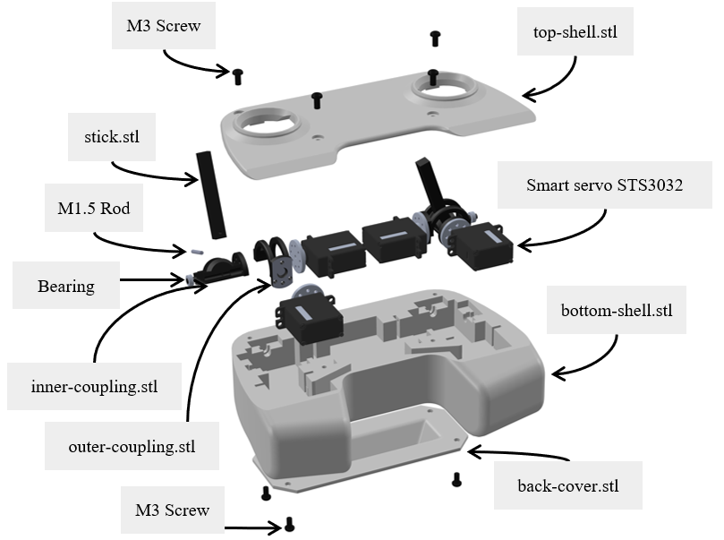

# Haptic RC

This folder contains the files to build the Haptic RC presented in the paper "Design and Control of an Omnidirectional Aerial Robot with 4DoF Haptic Joystick for Physical Interaction". The objective is to improve reproducibility in robotics, by providing an haptic remote controller for a telemanipulation system.

Virtual spring           |  Force feedback
:-------------------------:|:-------------------------:
  |  

## Overview

Giving the sense of touch while operating a drone in physical interaction is now possible with the haptic RC. Details on the embed technology is detailed bellow.

## Components

The haptic RC is a robot by its own with sensors and actuators. Here we describe the different components it embeds.

### 3D print

Even if prototypes have been printed in PLA, we advice to print the different parts in tough PETG. In fact, we noticed lower friction in the mechanism and more robustness toward potential impacts. Each 2-DoF actuation unit is composed of three component:

- [Stick](../Haptic_RC/parts/stick.stl) x 2
- [Inner coupling](../Haptic_RC/parts/inner-coupling.STL) x 2
- [Outer coupling](../Haptic_RC/parts/outer-coupling.stl) x 2

These actuators are attached to the main body of the RC, and covered with a top case and a back one:

- [Bottom shell](../Haptic_RC/parts/bottom-shell.stl)
- [Top shell](../Haptic_RC/parts/top-shell.stl)
- [Back cover](../Haptic_RC/parts/back-cover.stl)

### Electronics

The miniaturization of the electronical components makes the device different of previous haptic joystick. By embedding most of the electronics into a custom PCB, we managed to get a standard gamepad joystick form factor.

- [Custom powering unit](../Haptic_RC/electronics/Power_Board/)
- [Custom IMU board](../Haptic_RC/electronics/PCB_IMU/)
- STS3032 Smart servo x 4

The onboard ESP32 microcontroller of the power board has to be flashed with the proposed low level [software](../Haptic_RC/firmware/HapticRC/). Arduino IDE can be used to flash.

### Others

To maintain the actuation mechanism of each stick, it is necessary to add a total of four bearings to allow free rotation. The rotation between the stick and the inner coupling part is done with a rigid metalic rod. The screws attaching the top shell and the back cover to the bottom shell are all the same. They have to be screwed lastly and ensure a rigid connection of the all body.
The complementary material list follows:

- MR63ZZ bearings x 4
- M1.5 L12 rod x 2
- M3 L6 screws x 6

## 6DoF Command

The resulting device has a low-level control loop to make a virtual spring, provide some force feedback into the sticks. The 6-DoF command inputs, that include 4-DoF through the sticks and 2-DoF through the device orientation are transmitted to the robot with ROS2 topics. The bilateral telemanipulation loop is closed with the 4-DoF force feedback of the sticks.

Joystick driver can be found in the scripts folder with the [ROS2 workspace](https://github.com/tilties2/ws_omniquad).

## Aerial Robot

The omnidirectional robot [resources](../OmniQuad/README.md).
