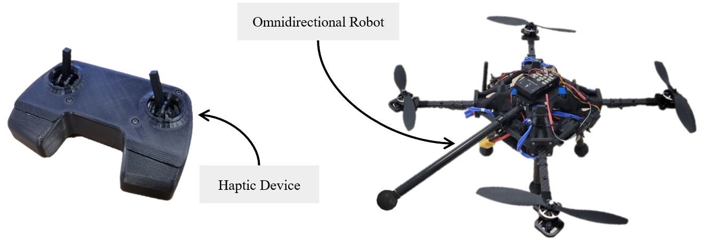

# Haptic-OmniQuad-Design

This repository contains the files necessary for building the Haptic RC and the omnidirectional drone (Omniquad) presented in the paper called "Design and Control of an Omnidirectional Aerial Robot with 4DoF Haptic Joystick for Physical Interaction". The ultimate objective is to improve reproducibility in robotics, by providing a complete telemanipulation system.

HAPTIC RC           |  OMNIQUAD
:-------------------------:|:-------------------------:
  |  

More information on the Autopilot integrated in Omniquad can be found here [PX4-Omniquad](https://github.com/tilties2/PX4-OmniQuad.git)

## Description

Fully actuated aerial robot proved their superior-ity for Aerial Physical Interaction (APhI) over the past years, nevertheless their complexity make them hard to access for most
of research center. This work wants to enhance accessibility of these technologies presenting a minimal setup for aerial telemanipulation. The design and the control of 4-degrees of freedom (DoF) haptic joystick is detailed. It enhance current form factor Micro Aerial Vehicle (MAV) Remote Controller (RC) with the sense of touch for the operator. The goal is to give operators an extra sense (more than vision, and sound) to help them performing APhI. On the other hand we optimized in term of weight and force the frame design of an Omnidirectional Micro Aerial Vehicle (OMAV). By reducing the number of components, we aim an simplified maintenance of such machine.

## Content of the repository

 In this repository, we share the CAD resorces for the open-source OMAV platform with
 Haptic RC:

- [OMAV platform CAD resources](OmniQuad/README.md)
- [Haptic-RC CAD resources](Haptic_RC/README.md)
